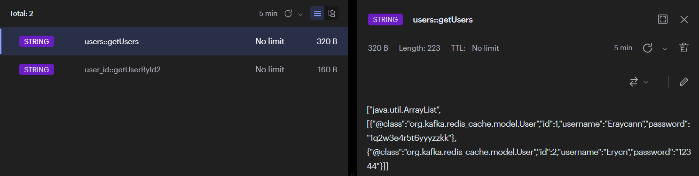

# 🚀 Redis ile Güçlendirilmiş Spring Boot Kullanıcı Yönetimi API'si 🚀
> Redis Öğrenirken Kurguladığım DEMO projem

## ✨ Proje Özeti

Bu proje, Spring Boot çatısı altında geliştirilmiş, Redis önbelleği ile optimize edilmiş bir kullanıcı yönetimi API'sidir. Amacımız, kullanıcı verilerine hızlı ve verimli bir şekilde erişim sağlamak, böylece uygulama performansını en üst düzeye çıkarmaktır. PostgreSQL veritabanı ile entegre çalışarak, güvenilir ve ölçeklenebilir bir çözüm sunuyoruz.

## 🎯 Hedefler

*   **Hızlı Erişim:** Redis önbelleği sayesinde kullanıcı bilgilerine milisaniyeler içinde erişim.
*   **Verimli Veri Yönetimi:** Kullanıcı oluşturma, güncelleme ve silme işlemlerini kolayca gerçekleştirme.
*   **Ölçeklenebilirlik:** Artan kullanıcı yükünü kaldırabilecek şekilde tasarlanmış bir mimari.
*   **Kolay Entegrasyon:** Mevcut sistemlere kolayca entegre edilebilen, standart REST API'leri.

## ⚙️ Teknolojiler

*   **Spring Boot:** Java tabanlı, hızlı uygulama geliştirme için ideal.
*   **Redis:** Bellek içi veri depolama çözümü, önbellekleme için mükemmel.
*   **PostgreSQL:** Güçlü ve güvenilir ilişkisel veritabanı.
*   **Lombok:** Daha az kodla daha çok iş yapmak için.
*   **Spring Data JPA:** Veritabanı işlemlerini kolaylaştıran araç.
*   **Spring Web:** RESTful API'ler oluşturmak için.

## 🧩 Nasıl Çalışır?

1.  Kullanıcı bir API isteği gönderir (örneğin, kullanıcı listesini almak için).
2.  Uygulama, önce Redis önbelleğini kontrol eder.
3.  Eğer veri önbellekte bulunursa, doğrudan kullanıcıya gönderilir (süper hızlı!).
4.  Eğer veri önbellekte yoksa, PostgreSQL veritabanından çekilir.
5.  Veri, kullanıcıya gönderilmeden önce Redis'e kaydedilir (gelecek sefer daha hızlı!).
6.  Kullanıcı oluşturma, güncelleme veya silme gibi işlemler yapıldığında, ilgili önbellekler otomatik olarak temizlenir (veri tutarlılığı!).

## 🛠️ Yapılandırma

`src/main/resources/application.properties` dosyasını düzenleyerek uygulamanızı kişiselleştirebilirsiniz. İşte bazı önemli ayarlar:

*   `spring.datasource.url`: PostgreSQL veritabanı bağlantı adresi (örneğin: `jdbc:postgresql://localhost:5432/mydb`).
*   `spring.datasource.username`: Veritabanı kullanıcı adı.
*   `spring.datasource.password`: Veritabanı parolası.
*   `spring.data.redis.host`: Redis sunucu adresi (genellikle `localhost`).
*   `spring.data.redis.port`: Redis portu (genellikle `6379`).
*   `spring.cache.redis.time-to-live`: Önbellekteki verilerin ne kadar süreyle saklanacağı (örneğin: `30m` - 30 dakika).

## 🕹️ API Kullanımı

Aşağıda bazı örnek API uç noktaları bulunmaktadır:

*   `POST /api/v1/users`: Yeni bir kullanıcı oluşturur. İstek gövdesinde (request body) kullanıcı bilgileri JSON formatında gönderilmelidir.
*   `GET /api/v1/users`: Tüm kullanıcıların listesini getirir (önbelleğe alınmış!).
*   `GET /api/v1/users/id?id={id}`: Belirli bir ID'ye sahip kullanıcıyı getirir (önbelleğe alınmış!).
*   `PUT /api/v1/users`: Mevcut bir kullanıcıyı günceller. İstek gövdesinde güncellenmiş kullanıcı bilgileri gönderilmelidir.
*   `DELETE /api/v1/users?id={id}`: Belirli bir ID'ye sahip kullanıcıyı siler.

## 📸 Ekran Görüntüleri

Uygulamanızın nasıl çalıştığını gösteren ekran görüntüleri:

*getUsers metodunun tetiklendiği an, önbellek.*

*updateUser yada getUserById metodunun tetiklendiği an, önbellek.*

## 🚀 Sonuç

Bu proje, Spring Boot ve Redis'in gücünü birleştirerek hızlı, verimli ve ölçeklenebilir bir kullanıcı yönetimi API'si sunar.